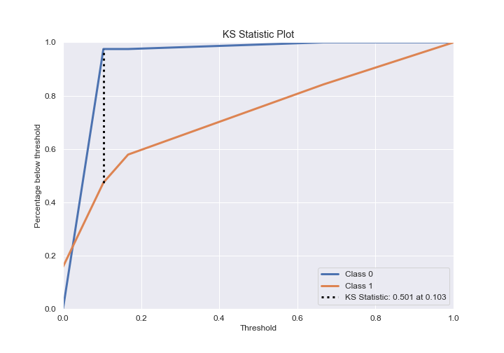

# Summary of 2_DecisionTree

[<< Go back](../README.md)

## Decision Tree
- **n_jobs**: -1
- **criterion**: gini
- **max_depth**: 3
- **explain_level**: 2

## Validation
 - **validation_type**: split
 - **train_ratio**: 0.75
 - **shuffle**: True
 - **stratify**: True

## Optimized metric
logloss

## Training time

31.5 seconds

## Metric details
|           |    score |   threshold |
|:----------|---------:|------------:|
| logloss   | 1.1191   |  nan        |
| auc       | 0.674342 |  nan        |
| f1        | 0.666667 |    0.103448 |
| accuracy  | 0.830508 |    0.103448 |
| precision | 1        |    0.833333 |
| recall    | 0.842105 |    0        |
| mcc       | 0.601452 |    0.103448 |

## Confusion matrix (at threshold=0.103448)
|              |   Predicted as 0 |   Predicted as 1 |
|:-------------|-----------------:|-----------------:|
| Labeled as 0 |               39 |                1 |
| Labeled as 1 |                9 |               10 |

## Learning curves

## Decision Tree 

### Tree #1

### Rules

if (I identify as having a mental illness <= 0.5) and (Panic attacks <= 0.5) and (I am on section 8 housing <= 0.5) then class: 0 (proba: 89.66%) | based on 116 samples

if (I identify as having a mental illness > 0.5) and (Obsessive thinking <= 0.5) and (Total length of any gaps in my resume in months. <= 28.0) then class: 1 (proba: 66.67%) | based on 24 samples

if (I identify as having a mental illness > 0.5) and (Obsessive thinking > 0.5) and (How many days were you hospitalized for your mental illness <= 62.5) then class: 1 (proba: 100.0%) | based on 18 samples

if (I identify as having a mental illness <= 0.5) and (Panic attacks > 0.5) and (Region <= 6.5) then class: 1 (proba: 87.5%) | based on 8 samples

if (I identify as having a mental illness > 0.5) and (Obsessive thinking <= 0.5) and (Total length of any gaps in my resume in months. > 28.0) then class: 0 (proba: 83.33%) | based on 6 samples

if (I identify as having a mental illness <= 0.5) and (Panic attacks > 0.5) and (Region > 6.5) then class: 0 (proba: 100.0%) | based on 2 samples

if (I identify as having a mental illness > 0.5) and (Obsessive thinking > 0.5) and (How many days were you hospitalized for your mental illness > 62.5) then class: 0 (proba: 100.0%) | based on 1 samples

if (I identify as having a mental illness <= 0.5) and (Panic attacks <= 0.5) and (I am on section 8 housing > 0.5) then class: 1 (proba: 100.0%) | based on 1 samples

## Permutation-based Importance

## Confusion Matrix

## Normalized Confusion Matrix

## ROC Curve

## Kolmogorov-Smirnov Statistic

## Precision-Recall Curve

## Calibration Curve

## Cumulative Gains Curve

## Lift Curve

## SHAP Importance

[<< Go back](../README.md)
