# Summary of 3_Linear

[<< Go back](../README.md)

## Logistic Regression (Linear)
- **n_jobs**: -1
- **explain_level**: 2

## Validation
 - **validation_type**: split
 - **train_ratio**: 0.75
 - **shuffle**: True
 - **stratify**: True

## Optimized metric
logloss

## Training time

16.9 seconds

## Metric details
|           |    score |    threshold |
|:----------|---------:|-------------:|
| logloss   | 0.435478 | nan          |
| auc       | 0.860526 | nan          |
| f1        | 0.723404 |   0.116349   |
| accuracy  | 0.847458 |   0.547948   |
| precision | 1        |   0.821205   |
| recall    | 1        |   0.00712681 |
| mcc       | 0.643037 |   0.547948   |

## Confusion matrix (at threshold=0.547948)
|              |   Predicted as 0 |   Predicted as 1 |
|:-------------|-----------------:|-----------------:|
| Labeled as 0 |               39 |                1 |
| Labeled as 1 |                8 |               11 |

## Learning curves
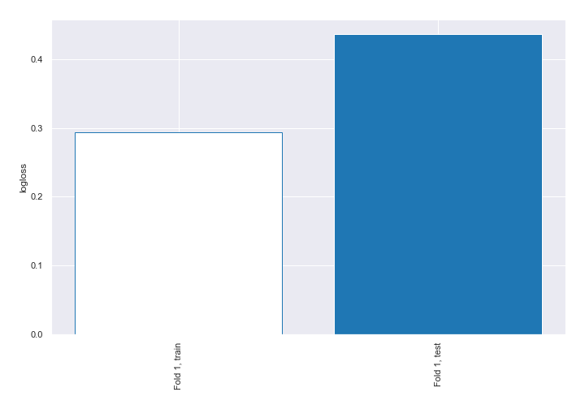

## Coefficients
| feature                                                      |   Learner_1 |
|:-------------------------------------------------------------|------------:|
| I identify as having a mental illness                        |   1.88329   |
| Panic attacks                                                |   1.6078    |
| Obsessive thinking                                           |   1.59199   |
| Lack of concentration                                        |   0.909854  |
| I am on section 8 housing                                    |   0.728329  |
| Mood swings                                                  |   0.56731   |
| How many days were you hospitalized for your mental illness  |   0.354032  |
| Education                                                    |   0.313243  |
| Annual income (including any social welfare programs) in USD |   0.247333  |
| I live with my parents                                       |   0.121565  |
| I read outside of work and school                            |   0.10548   |
| Household Income                                             |   0.0909826 |
| I am unemployed                                              |   0.0871809 |
| Region                                                       |   0.0759101 |
| I am legally disabled                                        |   0.0364808 |
| I am currently employed at least part-time                   |   0.0143841 |
| Total length of any gaps in my resume in months.             |  -0.0196346 |
| Annual income from social welfare programs                   |  -0.0858353 |
| I receive food stamps                                        |  -0.136351  |
| I have my regular access to the internet                     |  -0.194032  |
| Device Type                                                  |  -0.213867  |
| Tiredness                                                    |  -0.238551  |
| I have my own computer separate from a smart phone           |  -0.272834  |
| I have been hospitalized before for my mental illness        |  -0.276497  |
| I have a gap in my resume                                    |  -0.305403  |
| Gender                                                       |  -0.360932  |
| Age                                                          |  -0.698657  |
| How many times were you hospitalized for your mental illness |  -1.01784   |
| intercept                                                    |  -2.23557   |

## Permutation-based Importance
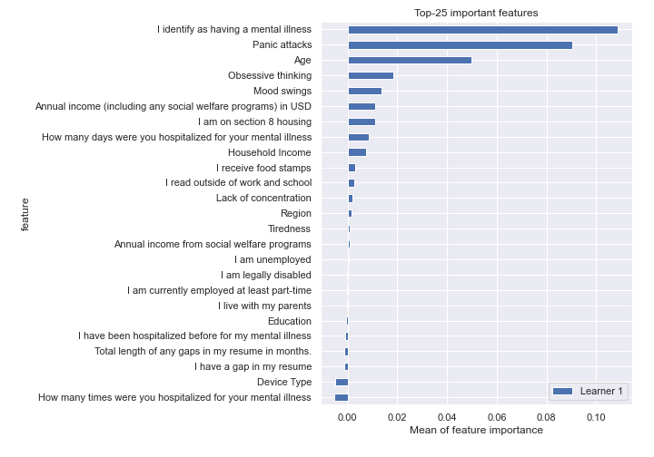
## Confusion Matrix

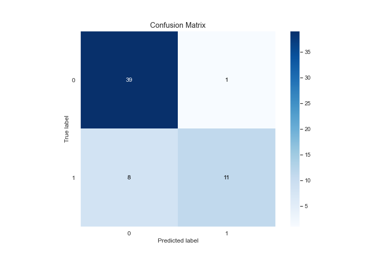

## Normalized Confusion Matrix

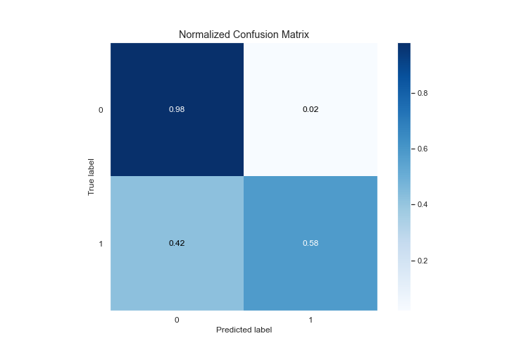

## ROC Curve

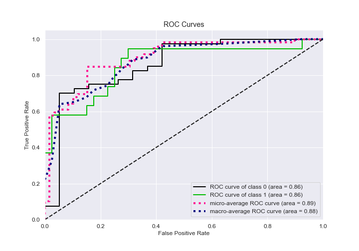

## Kolmogorov-Smirnov Statistic

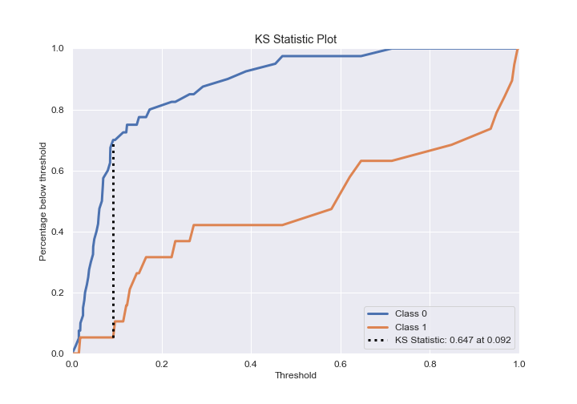

## Precision-Recall Curve

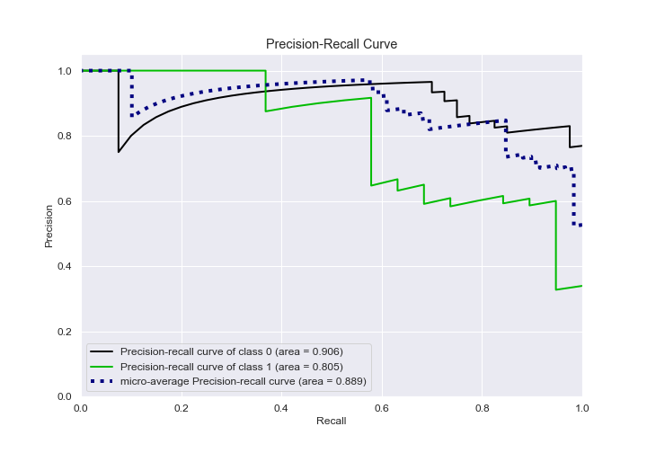

## Calibration Curve

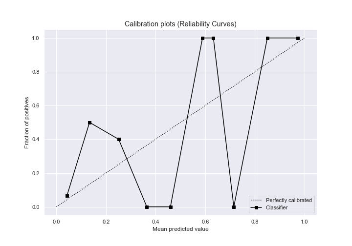

## Cumulative Gains Curve

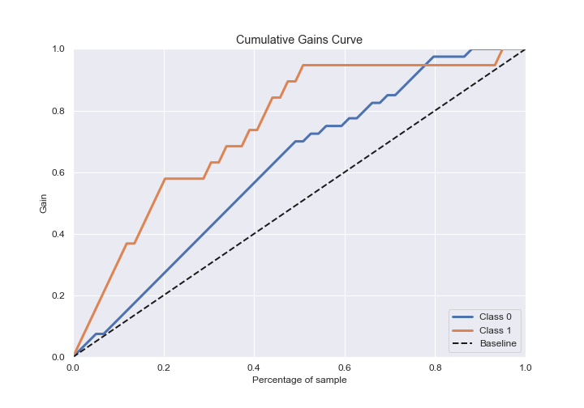

## Lift Curve

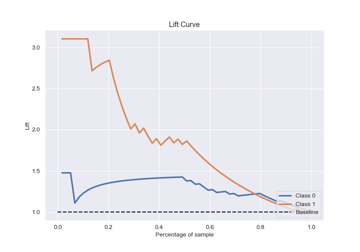

## SHAP Importance
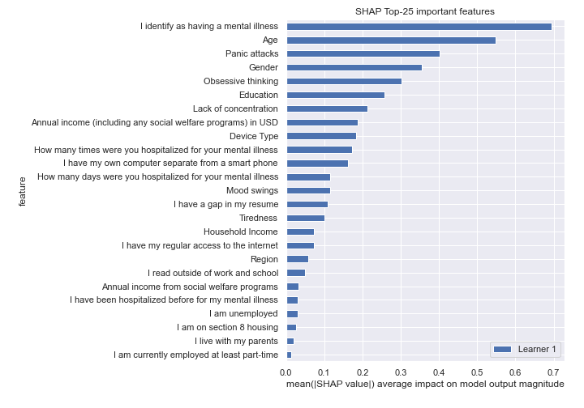

[<< Go back](../README.md)
