# Exploratory Data Analysis

[<< Go back](../README.md)
## Feature : target
- **Feature type** : discrete
- **Missing** : 0.0%
- **Unique** : 2
- **Count** :235.0
- **Mean** :0.3148936170212766
- **Std** :0.4654649010445176
- **Min** :0.0
- **25%th Percentile** : 0.0
- **50%th Percentile** : 0.0
- **75%th Percentile** : 1.0
- **Max** :1.0

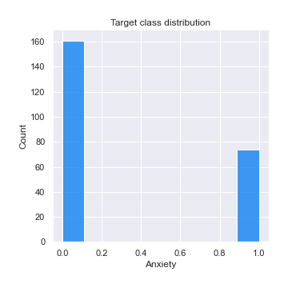
## Feature : I am currently employed at least part-time
- **Feature type** : discrete
- **Missing** : 0.0%
- **Unique** : 2
- **Count** :235.0
- **Mean** :0.676595744680851
- **Std** :0.46877398101959555
- **Min** :0.0
- **25%th Percentile** : 0.0
- **50%th Percentile** : 1.0
- **75%th Percentile** : 1.0
- **Max** :1.0

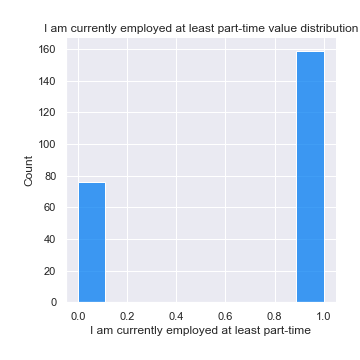
## Feature : I identify as having a mental illness
- **Feature type** : discrete
- **Missing** : 0.0%
- **Unique** : 2
- **Count** :235.0
- **Mean** :0.2553191489361702
- **Std** :0.43697117521077355
- **Min** :0.0
- **25%th Percentile** : 0.0
- **50%th Percentile** : 0.0
- **75%th Percentile** : 1.0
- **Max** :1.0

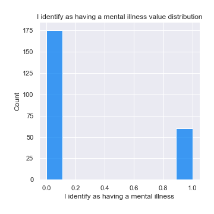
## Feature : Education
- **Feature type** : categorical
- **Missing** : 0.0%
- **Unique** : 8
- **Count** :235
- **Unique** :8
- **Top** :Completed Undergraduate
- **Freq** :69

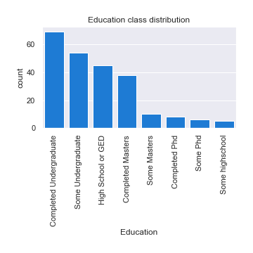
## Feature : I have my own computer separate from a smart phone
- **Feature type** : discrete
- **Missing** : 0.0%
- **Unique** : 2
- **Count** :235.0
- **Mean** :0.8893617021276595
- **Std** :0.3143532517774761
- **Min** :0.0
- **25%th Percentile** : 1.0
- **50%th Percentile** : 1.0
- **75%th Percentile** : 1.0
- **Max** :1.0

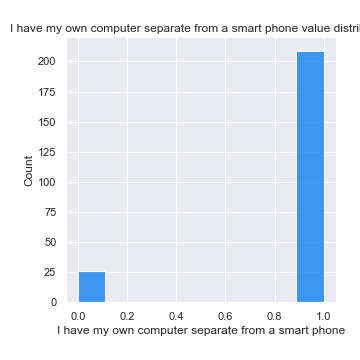
## Feature : I have been hospitalized before for my mental illness
- **Feature type** : discrete
- **Missing** : 0.0%
- **Unique** : 2
- **Count** :235.0
- **Mean** :0.08085106382978724
- **Std** :0.2731881242431594
- **Min** :0.0
- **25%th Percentile** : 0.0
- **50%th Percentile** : 0.0
- **75%th Percentile** : 0.0
- **Max** :1.0

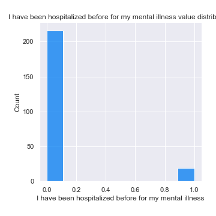
## Feature : How many days were you hospitalized for your mental illness
- **Feature type** : continous
- **Missing** : 0.0%
- **Unique** : 24
- **Count** :235.0
- **Mean** :3.5617021276595744
- **Std** :14.465971760331968
- **Min** :0.0
- **25%th Percentile** : 0.0
- **50%th Percentile** : 0.0
- **75%th Percentile** : 0.0
- **Max** :100.0

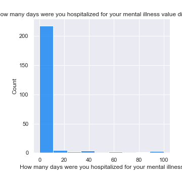
## Feature : I am legally disabled
- **Feature type** : discrete
- **Missing** : 0.0%
- **Unique** : 2
- **Count** :235.0
- **Mean** :0.09787234042553192
- **Std** :0.2977762035389525
- **Min** :0.0
- **25%th Percentile** : 0.0
- **50%th Percentile** : 0.0
- **75%th Percentile** : 0.0
- **Max** :1.0

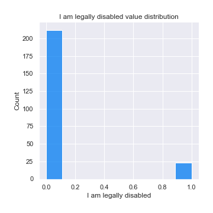
## Feature : I have my regular access to the internet
- **Feature type** : discrete
- **Missing** : 0.0%
- **Unique** : 2
- **Count** :235.0
- **Mean** :0.9702127659574468
- **Std** :0.17036272717555576
- **Min** :0.0
- **25%th Percentile** : 1.0
- **50%th Percentile** : 1.0
- **75%th Percentile** : 1.0
- **Max** :1.0

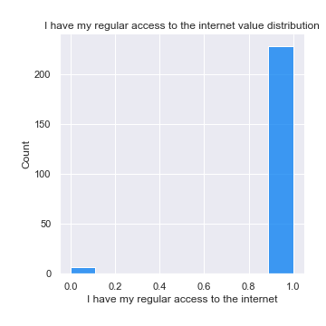
## Feature : I live with my parents
- **Feature type** : discrete
- **Missing** : 0.0%
- **Unique** : 2
- **Count** :235.0
- **Mean** :0.10212765957446808
- **Std** :0.3034624701884486
- **Min** :0.0
- **25%th Percentile** : 0.0
- **50%th Percentile** : 0.0
- **75%th Percentile** : 0.0
- **Max** :1.0

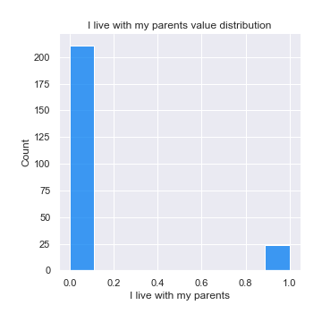
## Feature : I have a gap in my resume
- **Feature type** : discrete
- **Missing** : 0.0%
- **Unique** : 2
- **Count** :235.0
- **Mean** :0.251063829787234
- **Std** :0.4345507260552956
- **Min** :0.0
- **25%th Percentile** : 0.0
- **50%th Percentile** : 0.0
- **75%th Percentile** : 0.5
- **Max** :1.0

## Feature : Total length of any gaps in my resume in months.
- **Feature type** : discrete
- **Missing** : 0.0%
- **Unique** : 36
- **Count** :235.0
- **Mean** :9.608510638297872
- **Std** :22.23591294944733
- **Min** :0.0
- **25%th Percentile** : 0.0
- **50%th Percentile** : 0.0
- **75%th Percentile** : 6.0
- **Max** :100.0

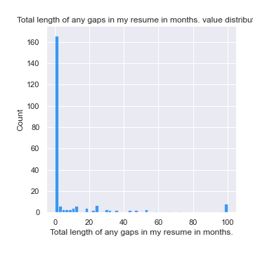
## Feature : Annual income (including any social welfare programs) in USD
- **Feature type** : discrete
- **Missing** : 0.0%
- **Unique** : 78
- **Count** :235.0
- **Mean** :38.43404255319149
- **Std** :31.012523501479293
- **Min** :0.0
- **25%th Percentile** : 12.5
- **50%th Percentile** : 33.0
- **75%th Percentile** : 55.0
- **Max** :100.0

_in_USD.png)
## Feature : I am unemployed
- **Feature type** : discrete
- **Missing** : 0.0%
- **Unique** : 2
- **Count** :235.0
- **Mean** :0.24680851063829787
- **Std** :0.432074633386581
- **Min** :0.0
- **25%th Percentile** : 0.0
- **50%th Percentile** : 0.0
- **75%th Percentile** : 0.0
- **Max** :1.0

## Feature : I read outside of work and school
- **Feature type** : discrete
- **Missing** : 0.0%
- **Unique** : 2
- **Count** :235.0
- **Mean** :0.8808510638297873
- **Std** :0.32465517398730404
- **Min** :0.0
- **25%th Percentile** : 1.0
- **50%th Percentile** : 1.0
- **75%th Percentile** : 1.0
- **Max** :1.0

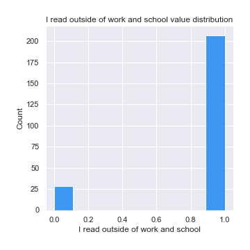
## Feature : Annual income from social welfare programs
- **Feature type** : discrete
- **Missing** : 0.0%
- **Unique** : 26
- **Count** :235.0
- **Mean** :3.1702127659574466
- **Std** :12.333886247024381
- **Min** :0.0
- **25%th Percentile** : 0.0
- **50%th Percentile** : 0.0
- **75%th Percentile** : 0.0
- **Max** :100.0

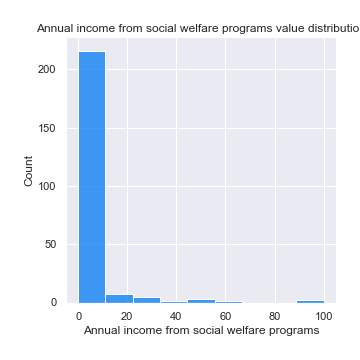
## Feature : I receive food stamps
- **Feature type** : discrete
- **Missing** : 0.0%
- **Unique** : 2
- **Count** :235.0
- **Mean** :0.05531914893617021
- **Std** :0.22909009036522313
- **Min** :0.0
- **25%th Percentile** : 0.0
- **50%th Percentile** : 0.0
- **75%th Percentile** : 0.0
- **Max** :1.0

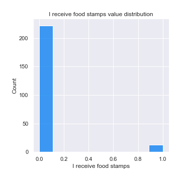
## Feature : I am on section 8 housing
- **Feature type** : discrete
- **Missing** : 0.0%
- **Unique** : 2
- **Count** :235.0
- **Mean** :0.01702127659574468
- **Std** :0.1296265987401021
- **Min** :0.0
- **25%th Percentile** : 0.0
- **50%th Percentile** : 0.0
- **75%th Percentile** : 0.0
- **Max** :1.0

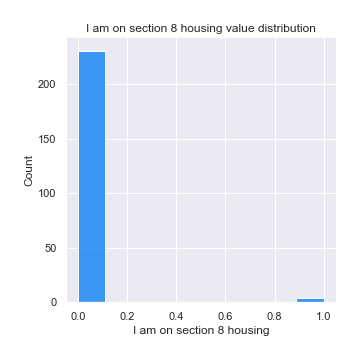
## Feature : How many times were you hospitalized for your mental illness
- **Feature type** : discrete
- **Missing** : 0.0%
- **Unique** : 12
- **Count** :235.0
- **Mean** :0.9063829787234042
- **Std** :5.619692339394802
- **Min** :0.0
- **25%th Percentile** : 0.0
- **50%th Percentile** : 0.0
- **75%th Percentile** : 0.0
- **Max** :69.0

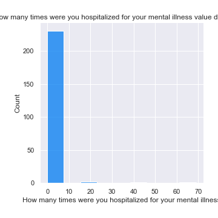
## Feature : Lack of concentration
- **Feature type** : continous
- **Missing** : 0.0%
- **Unique** : 2
- **Count** :235.0
- **Mean** :0.15319148936170213
- **Std** :0.3609407602445199
- **Min** :0.0
- **25%th Percentile** : 0.0
- **50%th Percentile** : 0.0
- **75%th Percentile** : 0.0
- **Max** :1.0

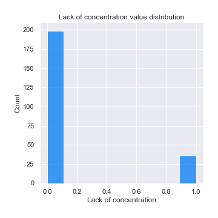
## Feature : Obsessive thinking
- **Feature type** : continous
- **Missing** : 0.0%
- **Unique** : 2
- **Count** :235.0
- **Mean** :0.13617021276595745
- **Std** :0.3437012790118753
- **Min** :0.0
- **25%th Percentile** : 0.0
- **50%th Percentile** : 0.0
- **75%th Percentile** : 0.0
- **Max** :1.0

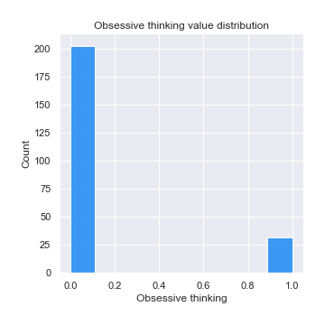
## Feature : Mood swings
- **Feature type** : continous
- **Missing** : 0.0%
- **Unique** : 2
- **Count** :235.0
- **Mean** :0.09787234042553192
- **Std** :0.29777620353895246
- **Min** :0.0
- **25%th Percentile** : 0.0
- **50%th Percentile** : 0.0
- **75%th Percentile** : 0.0
- **Max** :1.0

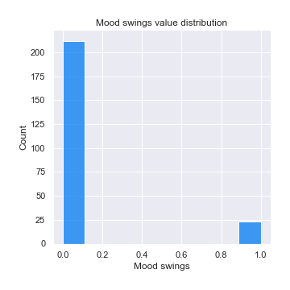
## Feature : Panic attacks
- **Feature type** : continous
- **Missing** : 0.0%
- **Unique** : 2
- **Count** :235.0
- **Mean** :0.14893617021276595
- **Std** :0.3567854705235669
- **Min** :0.0
- **25%th Percentile** : 0.0
- **50%th Percentile** : 0.0
- **75%th Percentile** : 0.0
- **Max** :1.0

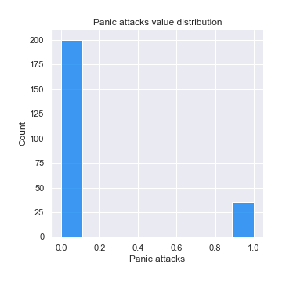
## Feature : Tiredness
- **Feature type** : continous
- **Missing** : 0.0%
- **Unique** : 2
- **Count** :235.0
- **Mean** :0.2978723404255319
- **Std** :0.4582992349563688
- **Min** :0.0
- **25%th Percentile** : 0.0
- **50%th Percentile** : 0.0
- **75%th Percentile** : 1.0
- **Max** :1.0

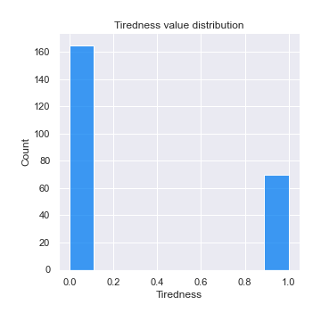
## Feature : Age
- **Feature type** : categorical
- **Missing** : 0.0%
- **Unique** : 4
- **Count** :235
- **Unique** :4
- **Top** :45-60
- **Freq** :73

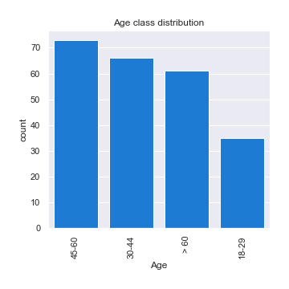
## Feature : Gender
- **Feature type** : categorical
- **Missing** : 0.0%
- **Unique** : 2
- **Count** :235
- **Unique** :2
- **Top** :Female
- **Freq** :124

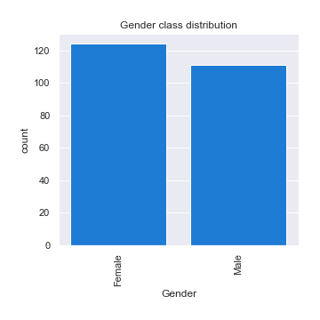
## Feature : Household Income
- **Feature type** : categorical
- **Missing** : 0.0%
- **Unique** : 11
- **Count** :235
- **Unique** :11
- **Top** :$25,000-$49,999
- **Freq** :49

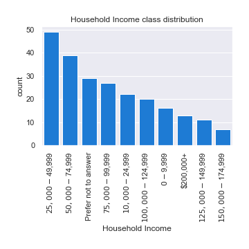
## Feature : Region
- **Feature type** : categorical
- **Missing** : 0.0%
- **Unique** : 9
- **Count** :235
- **Unique** :9
- **Top** :South Atlantic
- **Freq** :47

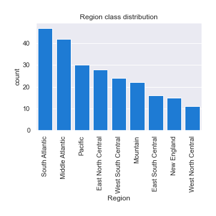
## Feature : Device Type
- **Feature type** : categorical
- **Missing** : 0.0%
- **Unique** : 5
- **Count** :235
- **Unique** :5
- **Top** :Windows Desktop / Laptop
- **Freq** :93

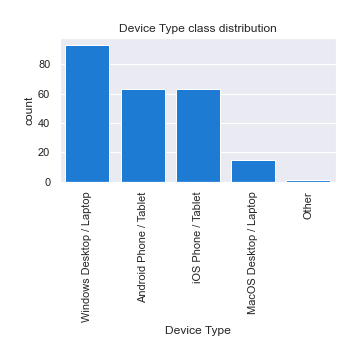

[<< Go back](../README.md)
