# Summary of 2_DecisionTree

[<< Go back](../README.md)

## Decision Tree
- **n_jobs**: -1
- **criterion**: gini
- **max_depth**: 3
- **explain_level**: 2

## Validation
 - **validation_type**: split
 - **train_ratio**: 0.75
 - **shuffle**: True
 - **stratify**: True

## Optimized metric
logloss

## Training time

38.1 seconds

## Metric details
|           |    score |   threshold |
|:----------|---------:|------------:|
| logloss   | 1.46325  |       nan   |
| auc       | 0.92037  |       nan   |
| f1        | 0.533333 |         0.5 |
| accuracy  | 0.881356 |         0.5 |
| precision | 0.4      |         0.5 |
| recall    | 1        |         0   |
| mcc       | 0.511367 |         0.5 |

## Confusion matrix (at threshold=0.5)
|              |   Predicted as 0 |   Predicted as 1 |
|:-------------|-----------------:|-----------------:|
| Labeled as 0 |               48 |                6 |
| Labeled as 1 |                1 |                4 |

## Learning curves
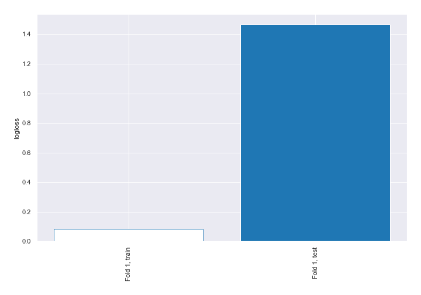

## Decision Tree 

### Tree #1

### Rules

if (Obsessive thinking <= 0.5) and (Total length of any gaps in my resume in months. <= 42.0) and (Panic attacks <= 0.5) then class: 0 (proba: 100.0%) | based on 134 samples

if (Obsessive thinking > 0.5) and (Mood swings <= 0.5) and (Region > 1.5) then class: 0 (proba: 71.43%) | based on 14 samples

if (Obsessive thinking <= 0.5) and (Total length of any gaps in my resume in months. > 42.0) and (I am on section 8 housing <= 0.5) then class: 0 (proba: 90.0%) | based on 10 samples

if (Obsessive thinking <= 0.5) and (Total length of any gaps in my resume in months. <= 42.0) and (Panic attacks > 0.5) then class: 0 (proba: 88.89%) | based on 9 samples

if (Obsessive thinking > 0.5) and (Mood swings > 0.5) then class: 1 (proba: 100.0%) | based on 6 samples

if (Obsessive thinking > 0.5) and (Mood swings <= 0.5) and (Region <= 1.5) then class: 1 (proba: 100.0%) | based on 2 samples

if (Obsessive thinking <= 0.5) and (Total length of any gaps in my resume in months. > 42.0) and (I am on section 8 housing > 0.5) then class: 1 (proba: 100.0%) | based on 1 samples

## Permutation-based Importance
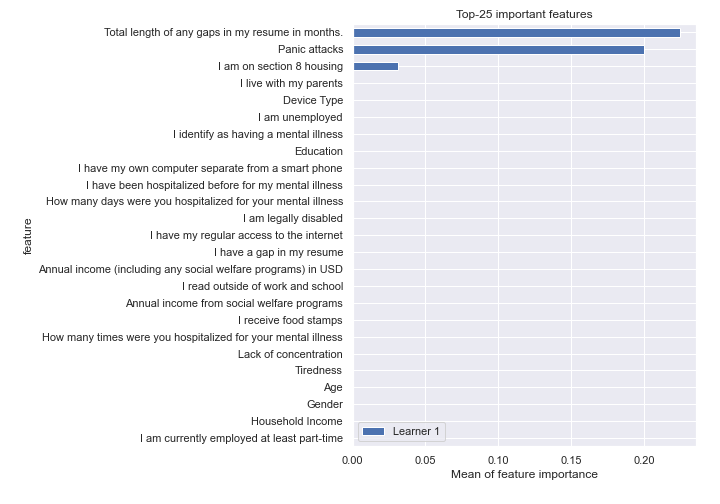
## Confusion Matrix

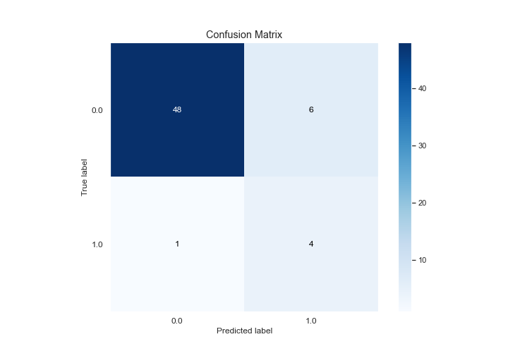

## Normalized Confusion Matrix

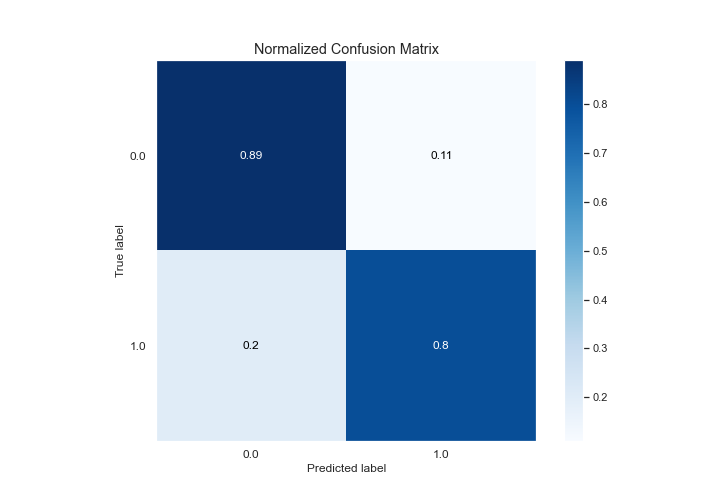

## ROC Curve

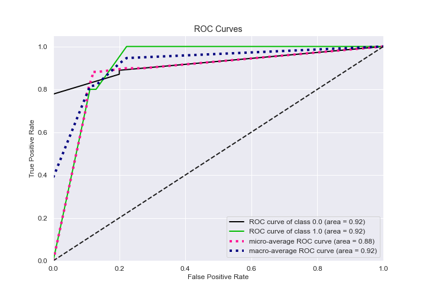

## Kolmogorov-Smirnov Statistic

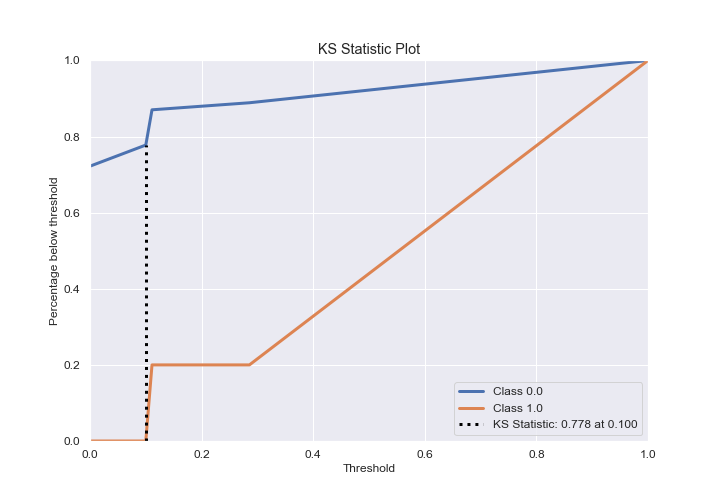

## Precision-Recall Curve

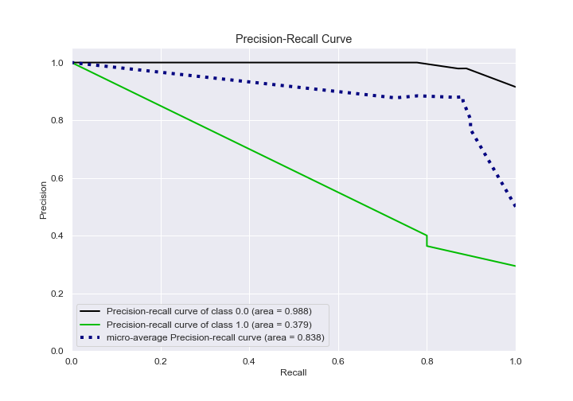

## Calibration Curve

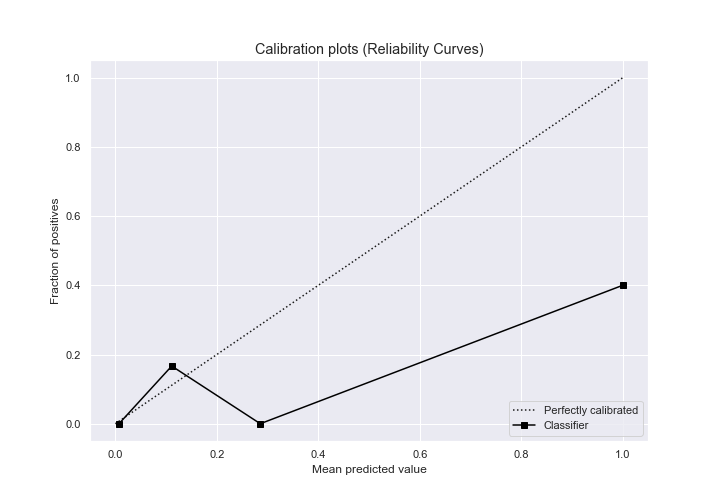

## Cumulative Gains Curve

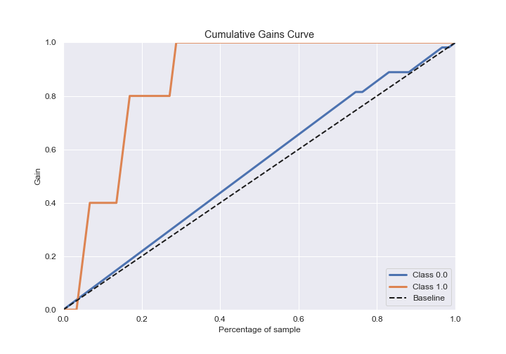

## Lift Curve

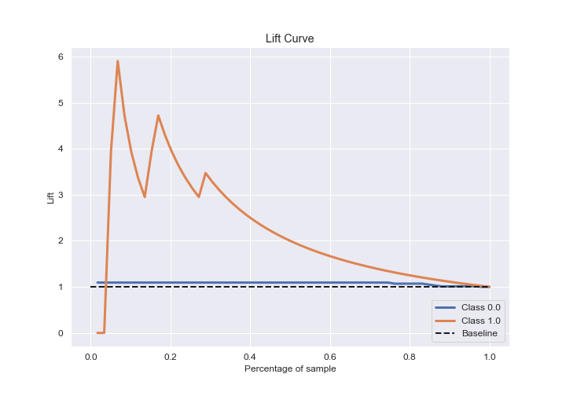

## SHAP Importance
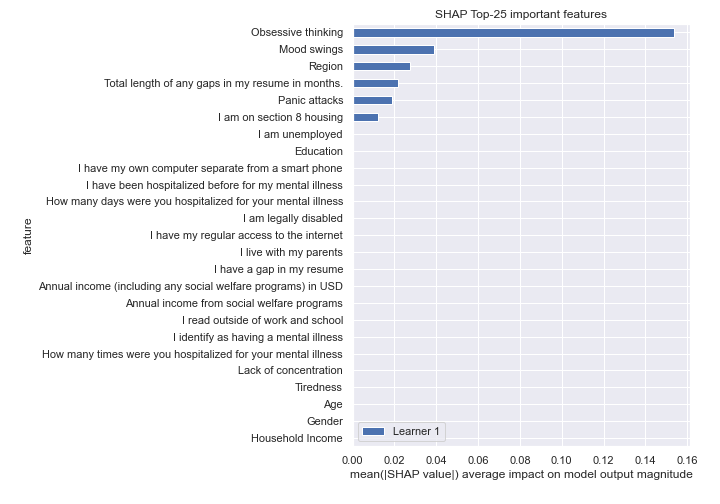

[<< Go back](../README.md)
