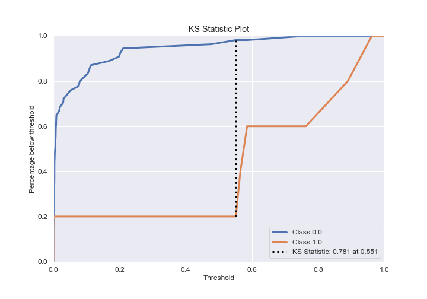

# Summary of 3_Linear

[<< Go back](../README.md)

## Logistic Regression (Linear)
- **n_jobs**: -1
- **explain_level**: 2

## Validation
 - **validation_type**: split
 - **train_ratio**: 0.75
 - **shuffle**: True
 - **stratify**: True

## Optimized metric
logloss

## Training time

5.1 seconds

## Metric details
|           |    score |     threshold |
|:----------|---------:|--------------:|
| logloss   | 0.334622 | nan           |
| auc       | 0.792593 | nan           |
| f1        | 0.727273 |   0.484615    |
| accuracy  | 0.949153 |   0.484615    |
| precision | 0.666667 |   0.620209    |
| recall    | 1        |   2.16004e-08 |
| mcc       | 0.703027 |   0.484615    |

## Confusion matrix (at threshold=0.484615)
|              |   Predicted as 0 |   Predicted as 1 |
|:-------------|-----------------:|-----------------:|
| Labeled as 0 |               52 |                2 |
| Labeled as 1 |                1 |                4 |

## Learning curves

## Coefficients
| feature                                                      |   Learner_1 |
|:-------------------------------------------------------------|------------:|
| Obsessive thinking                                           |   1.89542   |
| I identify as having a mental illness                        |   1.07188   |
| Mood swings                                                  |   0.888579  |
| I read outside of work and school                            |   0.722272  |
| Total length of any gaps in my resume in months.             |   0.666356  |
| Panic attacks                                                |   0.649741  |
| I am on section 8 housing                                    |   0.598397  |
| I have been hospitalized before for my mental illness        |   0.58942   |
| I am currently employed at least part-time                   |   0.545658  |
| I am legally disabled                                        |   0.504297  |
| I have a gap in my resume                                    |   0.442627  |
| I live with my parents                                       |   0.41759   |
| Tiredness                                                    |   0.368037  |
| I have my regular access to the internet                     |   0.250606  |
| I receive food stamps                                        |   0.238339  |
| Lack of concentration                                        |   0.233044  |
| Education                                                    |   0.201104  |
| I have my own computer separate from a smart phone           |   0.179585  |
| Household Income                                             |   0.13425   |
| Annual income from social welfare programs                   |  -0.0493131 |
| Region                                                       |  -0.0561039 |
| How many days were you hospitalized for your mental illness  |  -0.170425  |
| How many times were you hospitalized for your mental illness |  -0.210634  |
| Gender                                                       |  -0.219436  |
| Device Type                                                  |  -0.307901  |
| Annual income (including any social welfare programs) in USD |  -0.720718  |
| Age                                                          |  -0.847027  |
| I am unemployed                                              |  -0.933854  |
| intercept                                                    |  -5.10754   |

## Permutation-based Importance

## Confusion Matrix

## Normalized Confusion Matrix

## ROC Curve

## Kolmogorov-Smirnov Statistic

## Precision-Recall Curve

## Calibration Curve

## Cumulative Gains Curve

## Lift Curve

## SHAP Importance

[<< Go back](../README.md)
