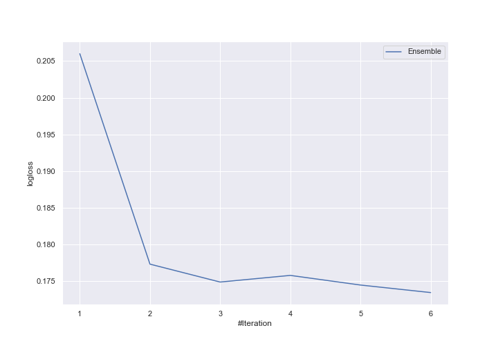
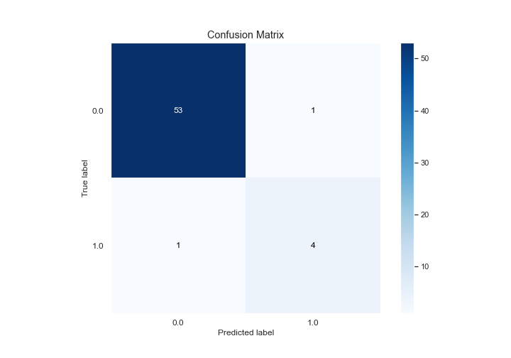
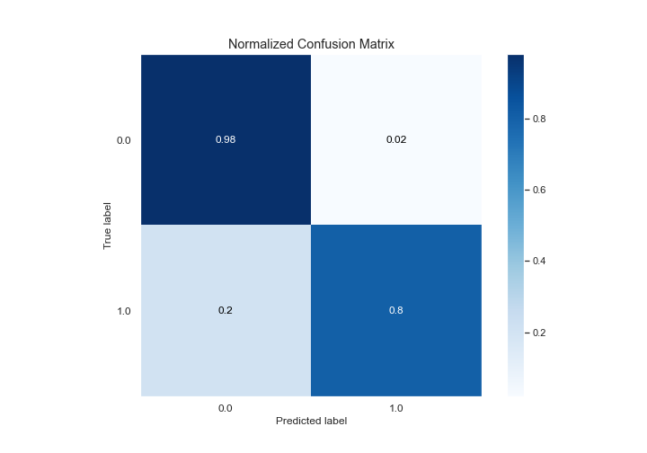
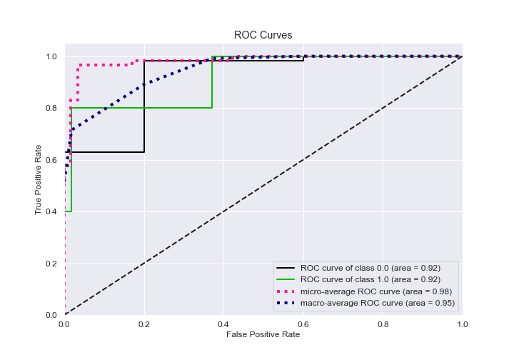
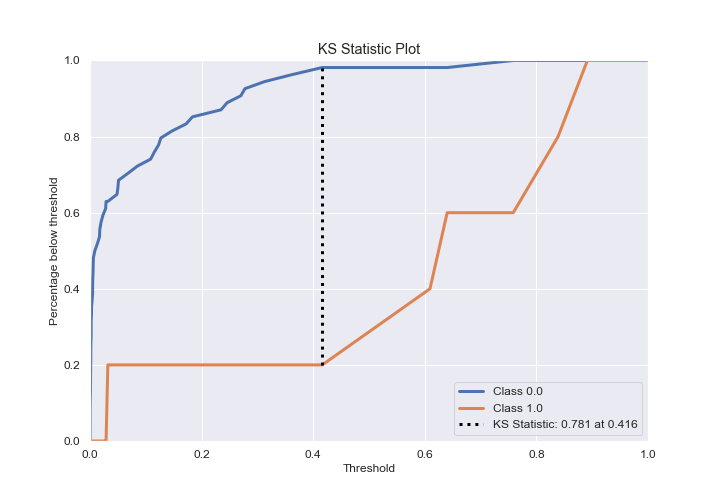
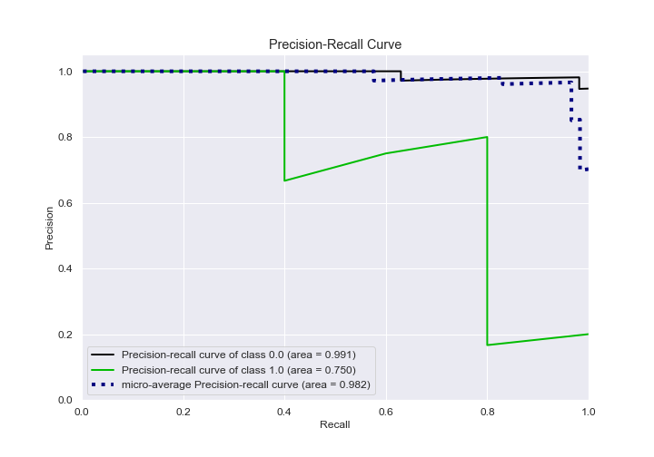
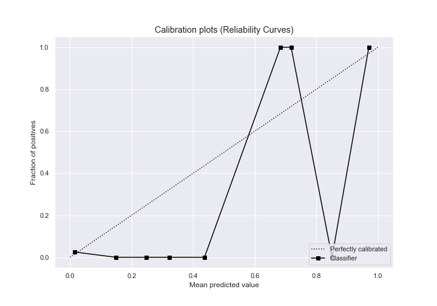
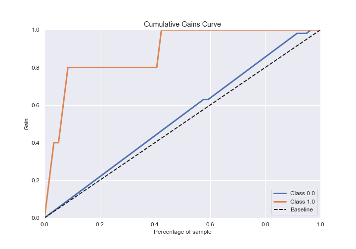
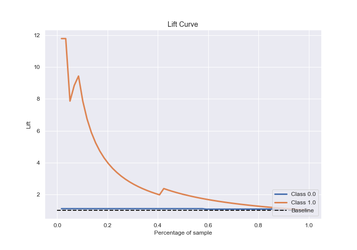

# Summary of Ensemble

[<< Go back](../README.md)

## Ensemble structure
| Model                  |   Weight |
|:-----------------------|---------:|
| 2_DecisionTree         |        1 |
| 3_Linear               |        4 |
| 6_Default_RandomForest |        1 |

## Metric details
|           |    score |     threshold |
|:----------|---------:|--------------:|
| logloss   | 0.173449 | nan           |
| auc       | 0.918519 | nan           |
| f1        | 0.8      |   0.422448    |
| accuracy  | 0.966102 |   0.422448    |
| precision | 0.8      |   0.422448    |
| recall    | 1        |   9.62491e-05 |
| mcc       | 0.781481 |   0.422448    |

## Confusion matrix (at threshold=0.422448)
|              |   Predicted as 0 |   Predicted as 1 |
|:-------------|-----------------:|-----------------:|
| Labeled as 0 |               53 |                1 |
| Labeled as 1 |                1 |                4 |

## Learning curves

## Confusion Matrix

## Normalized Confusion Matrix

## ROC Curve

## Kolmogorov-Smirnov Statistic

## Precision-Recall Curve

## Calibration Curve

## Cumulative Gains Curve

## Lift Curve

[<< Go back](../README.md)
