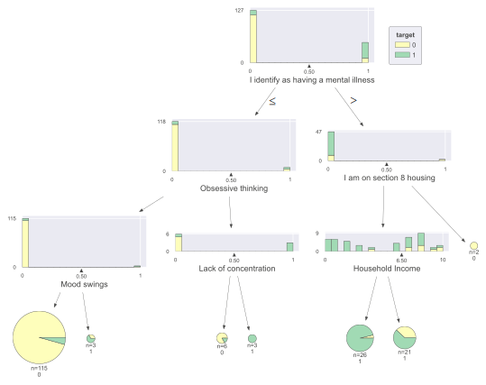

# Summary of 2_DecisionTree

[<< Go back](../README.md)

## Decision Tree
- **n_jobs**: -1
- **criterion**: gini
- **max_depth**: 3
- **explain_level**: 2

## Validation
 - **validation_type**: split
 - **train_ratio**: 0.75
 - **shuffle**: True
 - **stratify**: True

## Optimized metric
logloss

## Training time

45.5 seconds

## Metric details
|           |    score |   threshold |
|:----------|---------:|------------:|
| logloss   | 0.434383 | nan         |
| auc       | 0.827035 | nan         |
| f1        | 0.785714 |   0.105072  |
| accuracy  | 0.898305 |   0.105072  |
| precision | 0.916667 |   0.105072  |
| recall    | 1        |   0.0391304 |
| mcc       | 0.733639 |   0.105072  |

## Confusion matrix (at threshold=0.105072)
|              |   Predicted as 0 |   Predicted as 1 |
|:-------------|-----------------:|-----------------:|
| Labeled as 0 |               42 |                1 |
| Labeled as 1 |                5 |               11 |

## Learning curves

## Decision Tree 

### Tree #1

### Rules

if (I identify as having a mental illness <= 0.5) and (Obsessive thinking <= 0.5) and (Mood swings <= 0.5) then class: 0 (proba: 95.65%) | based on 115 samples

if (I identify as having a mental illness > 0.5) and (I am on section 8 housing <= 0.5) and (Household Income <= 6.5) then class: 1 (proba: 96.15%) | based on 26 samples

if (I identify as having a mental illness > 0.5) and (I am on section 8 housing <= 0.5) and (Household Income > 6.5) then class: 1 (proba: 61.9%) | based on 21 samples

if (I identify as having a mental illness <= 0.5) and (Obsessive thinking > 0.5) and (Lack of concentration <= 0.5) then class: 0 (proba: 83.33%) | based on 6 samples

if (I identify as having a mental illness <= 0.5) and (Obsessive thinking > 0.5) and (Lack of concentration > 0.5) then class: 1 (proba: 100.0%) | based on 3 samples

if (I identify as having a mental illness <= 0.5) and (Obsessive thinking <= 0.5) and (Mood swings > 0.5) then class: 1 (proba: 66.67%) | based on 3 samples

if (I identify as having a mental illness > 0.5) and (I am on section 8 housing > 0.5) then class: 0 (proba: 100.0%) | based on 2 samples

## Permutation-based Importance

## Confusion Matrix

## Normalized Confusion Matrix

## ROC Curve

## Kolmogorov-Smirnov Statistic

## Precision-Recall Curve

## Calibration Curve

## Cumulative Gains Curve

## Lift Curve

## SHAP Importance

[<< Go back](../README.md)
