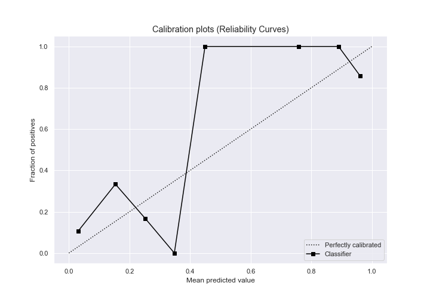

# Summary of 3_Linear

[<< Go back](../README.md)

## Logistic Regression (Linear)
- **n_jobs**: -1
- **explain_level**: 2

## Validation
 - **validation_type**: split
 - **train_ratio**: 0.75
 - **shuffle**: True
 - **stratify**: True

## Optimized metric
logloss

## Training time

4.9 seconds

## Metric details
|           |    score |   threshold |
|:----------|---------:|------------:|
| logloss   | 0.390355 | nan         |
| auc       | 0.873547 | nan         |
| f1        | 0.740741 |   0.391394  |
| accuracy  | 0.881356 |   0.391394  |
| precision | 1        |   0.957322  |
| recall    | 1        |   0.0134501 |
| mcc       | 0.686893 |   0.391394  |

## Confusion matrix (at threshold=0.391394)
|              |   Predicted as 0 |   Predicted as 1 |
|:-------------|-----------------:|-----------------:|
| Labeled as 0 |               42 |                1 |
| Labeled as 1 |                6 |               10 |

## Learning curves

## Coefficients
| feature                                                      |    Learner_1 |
|:-------------------------------------------------------------|-------------:|
| I identify as having a mental illness                        |  2.40983     |
| I have a gap in my resume                                    |  1.1888      |
| Panic attacks                                                |  1.12391     |
| Tiredness                                                    |  0.953648    |
| Lack of concentration                                        |  0.941288    |
| Mood swings                                                  |  0.5259      |
| Obsessive thinking                                           |  0.453783    |
| I am unemployed                                              |  0.420965    |
| I have been hospitalized before for my mental illness        |  0.368101    |
| I live with my parents                                       |  0.306026    |
| I am legally disabled                                        |  0.277767    |
| Annual income (including any social welfare programs) in USD |  0.24464     |
| I read outside of work and school                            |  0.155536    |
| I have my regular access to the internet                     |  0.107757    |
| How many days were you hospitalized for your mental illness  |  0.0880802   |
| I have my own computer separate from a smart phone           |  0.0228462   |
| Annual income from social welfare programs                   |  0.00284322  |
| Gender                                                       | -0.000530127 |
| I am currently employed at least part-time                   | -0.0427281   |
| Device Type                                                  | -0.0838627   |
| Region                                                       | -0.112031    |
| Education                                                    | -0.172113    |
| Total length of any gaps in my resume in months.             | -0.319372    |
| Age                                                          | -0.370393    |
| Household Income                                             | -0.498328    |
| How many times were you hospitalized for your mental illness | -0.521709    |
| I am on section 8 housing                                    | -0.899653    |
| I receive food stamps                                        | -1.05757     |
| intercept                                                    | -3.22538     |

## Permutation-based Importance

## Confusion Matrix

## Normalized Confusion Matrix

## ROC Curve

## Kolmogorov-Smirnov Statistic

## Precision-Recall Curve

## Calibration Curve

## Cumulative Gains Curve

## Lift Curve

## SHAP Importance

[<< Go back](../README.md)
