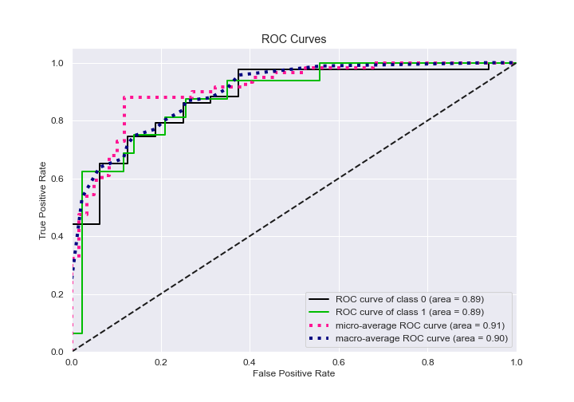

# Summary of Ensemble

[<< Go back](../README.md)

## Ensemble structure
| Model                   |   Weight |
|:------------------------|---------:|
| 3_Linear                |        2 |
| 5_Default_NeuralNetwork |        1 |
| 6_Default_RandomForest  |        3 |

## Metric details
|           |    score |   threshold |
|:----------|---------:|------------:|
| logloss   | 0.361451 | nan         |
| auc       | 0.885174 | nan         |
| f1        | 0.740741 |   0.436219  |
| accuracy  | 0.881356 |   0.436219  |
| precision | 0.909091 |   0.436219  |
| recall    | 1        |   0.0443568 |
| mcc       | 0.686893 |   0.436219  |

## Confusion matrix (at threshold=0.436219)
|              |   Predicted as 0 |   Predicted as 1 |
|:-------------|-----------------:|-----------------:|
| Labeled as 0 |               42 |                1 |
| Labeled as 1 |                6 |               10 |

## Learning curves

## Confusion Matrix

## Normalized Confusion Matrix

## ROC Curve

## Kolmogorov-Smirnov Statistic

## Precision-Recall Curve

## Calibration Curve

## Cumulative Gains Curve

## Lift Curve

[<< Go back](../README.md)
